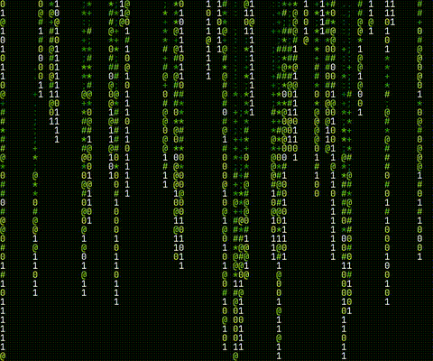

  

<table width="100%" align="center">
  <tr>
    <td width="30%" align="center" valign="middle">
      
      
📖 Estudando Python

      
😄 Pronouns: ele/dele

    </td>
    <td width="70%" valign="top">
      <h3>👨‍💻 Tecnologias que uso</h3>
      

        
        
        
        
      

    </td>
  </tr>
</table>

  

  
  
  
   

